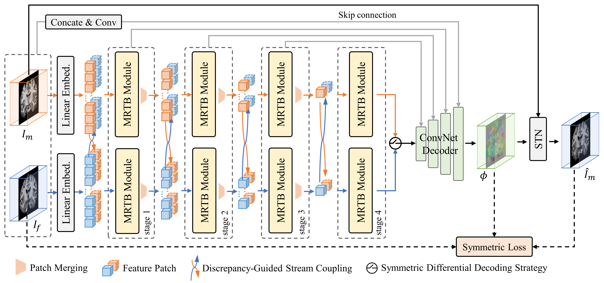
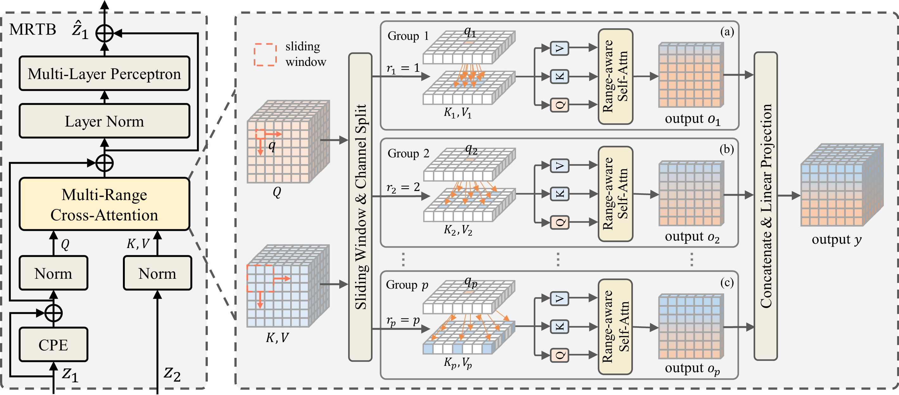

# A dual-stream transformer with multi-range cross-attention for medical image registration

<div align=center>


</div>


## Abstract
Image registration, a pivotal technique in medical image analysis, faces the challenge of establishing high-accuracy spatial correspondences across images. Although convolutional networks can expand local receptive fields by enlarging kernel size, their inherent hierarchical architecture and limited network depth still struggle to capture global dependencies. In contrast, Transformer-based architectures achieve long-range modeling through self-attention, but suffer from quadratic computation complexity. In this paper, we propose a novel dual-stream registration framework, termed MRMorph, which leverages multi-range cross-attention (MRCA) to efficiently correlate and match features across varying deformation scales. Unlike conventional attention mechanisms that rely on unrestricted global interactions, MRCA formulates registration as a range-constrained cross-image correspondence optimization problem, where range factors define homologous search neighborhoods and characterize deformation patterns at different spatial scales. Specifically, dual-stream branches with multi-range Transformer block (MRTB) independently encode input images, and a discrepancy-guided stream coupling (DGSC) mechanism is introduced during encoding to enhance feature interaction between the two streams. Within this process, MRCA establishes hierarchical correspondences by performing range-bounded cross-attention on multi-level feature representations, where each attention range is associated with a specific deformation scale. Subsequently, a symmetric differential decoding strategy (SDDS) is adopted to decode symmetric differential features between fixed and moving feature pyramids into bi-directional deformation fields, promoting symmetric deformation estimation and deformation regularity. Extensive experiments on multiple public datasets, covering both unimodal and multimodal registration tasks, show that MRMorph achieves competitive registration accuracy with favorable computational efficiency, highlighting its potential for medical image registration applications. The code is publicly available at https://github.com/huaibovip/MRMorph.


**The implementation of MRMorph is released soon**


## Laboratory
The Augmented Reality & Intelligent Medical Laboratory of Beijing Institute of Technology relies on the National Engineering Laboratory for Virtual and Augmented Reality, the Key Laboratory of Optoelectronic Imaging Technology and System of the Ministry of Education, and the Beijing Engineering Research Center for Mixed Reality and Novel Display. Centering on major clinical scientific issues, it has long been engaged in research fields including surgical navigation robot technology, intelligent medical information analysis technology, multimodal medical imaging technology and medical intelligent sensing technology. It has broken through bottlenecks in minimally invasive treatment, disease diagnosis, visual detection, quantitative perception and other aspects, and achieved a series of research achievements.


## Citation

```bibtex
@Article{paper,
  title = {A dual-stream transformer with multi-range cross-attention for medical image registration},
  author = {Huaibo Hao, Deqiang Xiao, Yucong Lin, Long Shao, Danni Ai, Jingfan Fan, Tianyu Fu, Hong Song, and Jian Yang},
  year = {2026},
}
```
  <!-- journal = {},
  volume = {},
  pages = {},
  year = {}, -->
